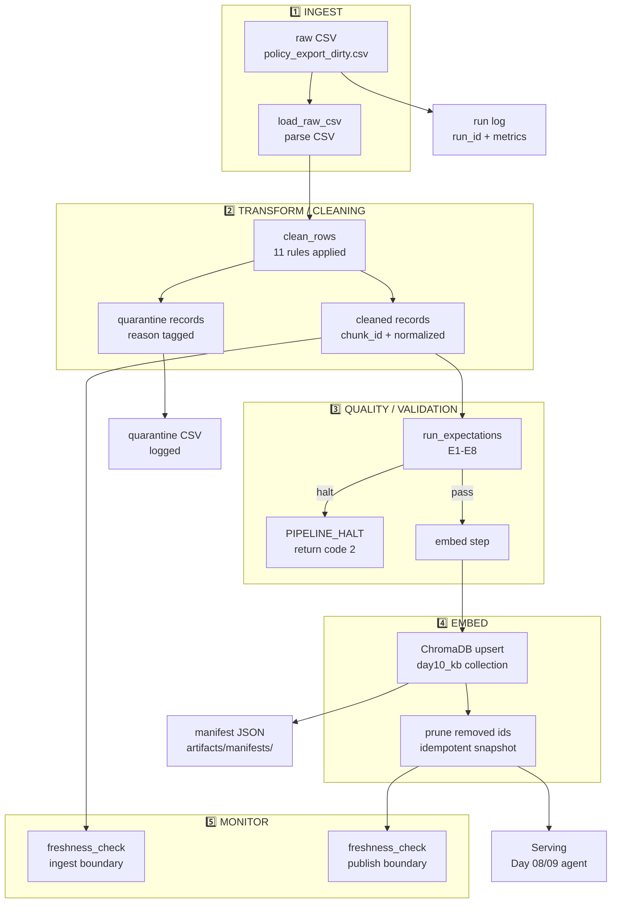

# Kiến trúc pipeline — Lab Day 10

**Nhóm:** Day10-Team
**Cập nhật:** 2026-04-15

---

## 1. Sơ đồ luồng (Mermaid)

> **Boundary đo freshness:** 2 điểm
> - **Ingest boundary**: `exported_at` từ raw CSV → measure data age tại thời điểm export
> - **Publish boundary**: `run_timestamp` từ manifest → measure pipeline latency

---

## 2. Ranh giới trách nhiệm

| Thành phần | Input | Output | Owner nhóm |
|------------|-------|--------|------------|
| **Ingest** | `data/raw/policy_export_dirty.csv` | `List[Dict]` raw rows | Ingestion Owner |
| **Transform/Cleaning** | raw rows | cleaned CSV + quarantine CSV | Cleaning Owner |
| **Quality/Validation** | cleaned rows | expectation results (pass/halt) + log | Quality Owner |
| **Embed** | cleaned CSV | ChromaDB collection `day10_kb` upsert | Embed Owner |
| **Monitor** | manifest JSON | freshness PASS/WARN/FAIL + log | Monitoring Owner |

---

## 3. Idempotency & rerun

Pipeline dùng chiến lược **upsert theo `chunk_id`** trong ChromaDB:

1. **Upsert**: mỗi run tính `chunk_id = f(doc_id, chunk_text, seq)` (SHA256 hash prefix)
   - Nếu `chunk_id` đã tồn tại → update document + metadata
   - Nếu chưa → insert mới
2. **Prune**: sau upsert, xóa các `chunk_id` trong collection nhưng **không có** trong cleaned run này
   - Đảm bảo vector snapshot luôn khớp với cleaned data
   - Tránh "mồi cũ" trong top-k retrieval
   - Log: `embed_prune_removed=N`
3. **Rerun 2 lần**: không phình tài nguyên, không duplicate vector, collection size ổn định

---

## 4. Liên hệ Day 09

Pipeline này cung cấp corpus đã clean + embed vào ChromaDB collection `day10_kb`.
Day 08/09 agent dùng cùng collection để retrieval qua câu hỏi user về:
- Chính sách hoàn tiền (policy_refund_v4)
- SLA ticket IT (sla_p1_2026)
- FAQ helpdesk IT (it_helpdesk_faq)
- Chính sách nghỉ phép HR (hr_leave_policy)

**Không dùng chung collection với Day 09** (`day09_kb` vs `day10_kb`) để tránh nhiễu.

---

## 5. Rủi ro đã biết

- **Bản cũ stale 14 ngày hoàn tiền**: đã fix bằng Rule 6 trong cleaning_rules.py
- **Bản HR 2025 (10 ngày phép)**: quarantine bằng rule effective_date < 2026-01-01
- **CSV date format DD/MM/YYYY**: parse bằng `_DMY_SLASH` regex trong `_normalize_effective_date`
- **Missing grading_questions.json**: sẽ được publish lúc 17:00, grading_run.py sẽ dùng file đó